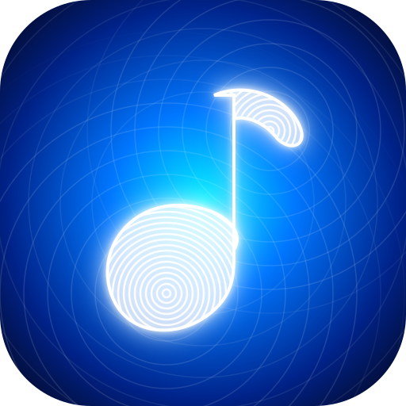

<div align="center">

  

  # Pulsr Music
  ### Premium Offline-First Local Music Player for Android & Beyond

  <p align="center">
    <strong>Studio-grade DSP • 10-Band AutoEQ • Synced LRC Lyrics • Dynamic Aura Theming • 100% Offline & Private</strong>
  </p>

  <p align="center">
    <a href="https://flutter.dev"></a>
    <a href="https://dart.dev"></a>
    <a href="#"></a>
    <a href="https://github.com/DevEslam1/pulsr/releases"></a>
    <a href="LICENSE"></a>
  </p>

  <p align="center">
    <a href="#-key-features">Features</a> •
    <a href="#-landing-website">Website</a> •
    <a href="#-architecture--tech-stack">Architecture</a> •
    <a href="#-headphone-calibration--autoeq">AutoEQ Profiles</a> •
    <a href="#-getting-started--build-guide">Getting Started</a> •
    <a href="#-permissions--privacy-matrix">Privacy Matrix</a>
  </p>

</div>

---

## 🌟 Overview

**Pulsr Music** is an audiophile-grade, offline-first music player engineered with Flutter, Dart, BLoC, and Drift SQLite. It strips away cloud bloat, algorithmic subscriptions, and privacy-invasive analytics to deliver an ultra-fast, local music playback experience with dynamic aesthetics and hardware-accelerated DSP.

Whether you're listening to 24-bit/192kHz lossless FLAC albums or organizing your local MP3 catalog, Pulsr provides bit-perfect audio decoding, precision acoustic equalization, interactive karaoke lyrics, and a fluid Aura design system.

---

## 🌐 Landing Website

Pulsr comes with an interactive landing website located in [`website/`](website/):

- **Live Interactive Player Mockup**: Real-time HTML5 audio visualizer, seekbar, and dynamic Aura theme switcher.
- **Parametric 10-Band EQ Sandbox**: Interactive frequency response curve renderer with headphone target presets.
- **Karaoke Lyrics Scroller**: Millisecond-synced lyrics with tap-to-seek preview.
- **Audio Format Compatibility Matrix**: FLAC, ALAC, WAV, AAC, MP3, OPUS, and OGG.
- **Direct APK & SHA-256 Download Hub**: Universal release verification.

> To preview the website locally, open [`website/index.html`](website/index.html) in any modern web browser or serve via `npx serve website` / GitHub Pages.

---

## ✨ Key Features

### 🎧 1. Audiophile Audio Engine & DSP
- **10-Band Graphic Equalizer**: Precision ±12dB sliders spanning from 31Hz sub-bass up to 16kHz brilliance.
- **AutoEQ Headphone Calibration**: Bundled compensation curves for industry-leading headphones (*Harman Target 2019/2018, Apple AirPods Pro, Sony WH-1000XM4/XM5, Sennheiser HD600, Beyerdynamic*).
- **Acoustic Enhancement Suite**: Bass Boost, 3D Spatial Virtualizer, Preamp Gain adjustment, and Reverb simulation.
- **Bit-Perfect Hi-Res Badging**: Real-time playback detection for sample rates (44.1kHz – 192kHz) and bit depths (16-bit, 24-bit, 32-bit float).
- **Audiophile Playback Controls**: Gapless playback, crossfade transitions, variable pitch/playback speed (0.5x to 2.5x), and sleep timer with gradual volume ducking.

### 💎 2. Aura Dynamic Design System
- **Album-Art Color Extraction**: Dynamic UI palettes generated in real time from album artwork using `palette_generator`.
- **4 Now Playing Themes**:
  1. *Classic Glassmorphism*: Deep blur overlays and ambient neon glow.
  2. *Minimalist*: Clean typography and distraction-free audio controls.
  3. *Card Deck*: Tactile card elevation with swipeable queue gestures.
  4. *Modern Vinyl / Circle*: Rotating vinyl turntable with acoustic concentric rings.
- **AMOLED Pure Black & Light Modes**: True `#000000` AMOLED mode for battery saving on OLED screens.
- **Edge-to-Edge Experience**: Fully transparent status bar and gesture navigation bar on Android 14+.

### ⚡ 3. SQLite-Indexed Smart Music Library
- **Blazing Fast Scanning**: Powered by Drift SQLite, scanning and indexing 10,000+ local tracks in under 2 seconds.
- **Multi-Dimensional Navigation**: Browse by *Songs, Albums, Artists, Genres, Folders, Playlists, Years, and Favorites*.
- **Advanced Folder Browser**: Direct storage hierarchy navigation with `.nomedia` compliance and custom blacklist folder exclusions.
- **Smart Auto-Playlists**:
  - *Most Played* (dynamic play count tracker)
  - *Recently Added* (indexed timestamp sorting)
  - *Recently Played* (listening history)
  - *Forgotten Gems* (high-rated or frequently played songs untouched for 30+ days)
  - *High Energy / BPM* (custom smart rule builder)

### 🎤 4. Millisecond Synced LRC Lyrics
- **Kinetic Karaoke Autoscroll**: Millisecond-precision scrolling that tracks the active vocal line.
- **Interactive Tap-to-Seek**: Tap any lyric line to jump directly to that song timestamp.
- **Offset Calibration**: On-the-fly latency adjuster (±50ms steps) to fix out-of-sync files.
- **Universal Fallback**: Automatic detection of external `.lrc` files, embedded ID3 tags, and unsynced plain text lyrics.

### 🏷️ 5. Embedded ID3 & Cover Art Editor
- **Direct In-Place Editing**: Modify Title, Artist, Album, Genre, Year, Track Number, and Disc Number directly in the audio files.
- **Artwork Injector**: Pick high-res album covers from your gallery or camera and embed them into MP3, FLAC, M4A, OGG, and WAV containers.

### 📱 6. Deep Android OS Integration
- **Android Home Screen Widgets**: Interactive home screen playback widgets (`home_widget`) with live album art and transport controls.
- **MediaStyle Notifications**: Full notification shade and lockscreen controls with real-time seekbars.
- **Hardware & Headset Events**: Auto-pause on headphone disconnection, Bluetooth AVRCP metadata sync, and audio ducking during GPS navigation/calls.
- **Audio File Intent Handler**: Instantly opens and plays `.mp3`, `.flac`, `.wav`, `.m4a` files opened from file managers or chat apps.

### 🛡️ 7. Absolute Privacy & Zero Telemetry
- **100% Offline Operation**: No account creation, no internet permission required for playback, no trackers, and no ad SDKs.
- **Data Safety**: All library indexes, ratings, and playlists remain strictly on your device.

---

## 🎧 Headphone Calibration & AutoEQ

Pulsr includes built-in parametric target profiles based on the AutoEQ database and Harman research:

| Profile | Category | Target Curve / Focus | Preamp |
|---|---|---|---|
| **Harman In-Ear (2019)** | Target Curve | Harman Target In-Ear Benchmark | -3.5 dB |
| **Harman Over-Ear (2018)**| Target Curve | Harman Acoustic Target (Over-Ear) | -2.5 dB |
| **Apple AirPods Pro (2nd Gen)** | TWS Earbuds | Neutralized mids + sub-bass extension | -1.5 dB |
| **Apple AirPods Max** | Over-Ear | High-frequency smoothing | -1.5 dB |
| **Sony WH-1000XM5** | Over-Ear ANC | Mid-bass de-bloat & vocal clarity | -2.0 dB |
| **Sony WF-1000XM4** | TWS Earbuds | Upper-treble resonance compensation | -2.0 dB |
| **Sennheiser HD 600** | Open-Back | Sub-bass extension + neutral midrange | -1.5 dB |
| **Beyerdynamic DT 770 Pro** | Studio Monitor| Treble spike smoothing at 6-8kHz | -3.0 dB |
| **Club Bass Boost** | Dynamic DSP | Elevated sub-bass & punchy 60-120Hz | -3.0 dB |
| **Studio Flat** | Bypass | 0dB Bit-perfect neutral bypass | 0.0 dB |

---

## 🏗️ Architecture & Tech Stack

Pulsr is architected around **Clean Architecture** and the **BLoC (Cubit)** state management pattern to ensure testability, separation of concerns, and rock-solid reliability.

```
┌─────────────────────────────────────────────────────────────┐
│                      PRESENTATION LAYER                     │
│  Flutter Widgets • Aura Design Tokens • GoRouter Navigation  │
│  LibraryCubit • PlayerCubit • PlaylistCubit • SettingsCubit │
└──────────────────────────────┬──────────────────────────────┘
                               │ (calls use cases)
┌──────────────────────────────▼──────────────────────────────┐
│                         DOMAIN LAYER                        │
│  Entities • Use Cases (Search, Playlists, Scanners, Audio)  │
│  Repository Interfaces • Functional Failure Types (fpdart)  │
└──────────────────────────────┬──────────────────────────────┘
                               │ (implements interfaces)
┌──────────────────────────────▼──────────────────────────────┐
│                          DATA LAYER                         │
│  Drift SQLite Database • Media Scanner • AudioHandler (DSP) │
│  JustAudio Player • AudioSession • HomeWidget Service       │
└─────────────────────────────────────────────────────────────┘
```

### Tech Stack Summary
- **UI Framework**: [Flutter 3.x](https://flutter.dev) & [Dart 3.x](https://dart.dev)
- **State Management**: [`flutter_bloc`](https://pub.dev/packages/flutter_bloc) (Cubit)
- **Database & Persistence**: [`drift`](https://pub.dev/packages/drift) (Type-safe SQLite) + [`shared_preferences`](https://pub.dev/packages/shared_preferences)
- **Audio Engine**: [`just_audio`](https://pub.dev/packages/just_audio), [`audio_service`](https://pub.dev/packages/audio_service), [`audio_session`](https://pub.dev/packages/audio_session)
- **Media Indexing**: [`on_audio_query`](https://pub.dev/packages/on_audio_query) + direct Storage File Scanner
- **Dynamic Palette**: [`palette_generator`](https://pub.dev/packages/palette_generator)
- **Animations**: [`flutter_animate`](https://pub.dev/packages/flutter_animate)
- **Routing**: [`go_router`](https://pub.dev/packages/go_router)
- **Dependency Injection**: [`get_it`](https://pub.dev/packages/get_it) + [`injectable`](https://pub.dev/packages/injectable)
- **Code Generation**: [`build_runner`](https://pub.dev/packages/build_runner), [`freezed`](https://pub.dev/packages/freezed), [`drift_dev`](https://pub.dev/packages/drift_dev)
- **Functional Programming**: [`fpdart`](https://pub.dev/packages/fpdart)

---

## 📁 Project Structure

```
pulsr/
├── assets/
│   ├── app_icon/             # High-res SVG and PNG app icons
│   ├── eq_profiles/          # AutoEQ headphone JSON calibrations
│   └── fonts/                # Manrope variable typography
├── docs/
│   ├── AUDIO_INTERRUPT_MATRIX.md   # Audio focus & ducking test matrix
│   └── PLAY_CONSOLE_READINESS.md   # Google Play data safety & compliance audit
├── lib/
│   ├── core/
│   │   ├── config/           # App constants & Sentry crash config
│   │   ├── constants/        # Color tokens, radii, metrics
│   │   ├── di/               # GetIt dependency injection setup
│   │   ├── router/           # GoRouter route definitions
│   │   ├── services/         # File intent handler & restore detection
│   │   └── theme/            # AuraTheme tokens & DynamicThemeCubit
│   ├── data/
│   │   ├── audio/            # JustAudio handler, Equalizer DSP & queue
│   │   ├── db/               # Drift SQLite schema & DAOs
│   │   ├── models/           # Song, Album, Artist, Playlist models
│   │   ├── repositories/     # Concrete MusicRepository implementation
│   │   └── scanner/          # MediaStore & direct file scanner
│   ├── domain/
│   │   ├── entities/         # Core domain entities
│   │   ├── repositories/     # Abstract repository interfaces
│   │   └── usecases/         # Business logic & query use cases
│   ├── features/
│   │   ├── home/             # Dashboard, recent tracks & quick picks
│   │   ├── library/          # Songs, Albums, Artists, Folders tabs
│   │   ├── player/           # Now Playing screen, 4 themes, DSP sheets
│   │   ├── playlists/        # Custom & Smart playlist manager
│   │   ├── queue/            # Interactive queue manager
│   │   ├── search/           # Instant fuzzy search
│   │   ├── settings/         # Equalizer, backup/restore, blacklist
│   │   └── tag_editor/       # In-place ID3 tag & cover art editor
│   ├── l10n/                 # ARB localizations (EN, ES, AR)
│   └── main.dart             # App entrypoint & initialization
├── test/                     # Unit, Cubit & Repository tests
├── website/                  # Landing website & interactive sandbox
│   ├── assets/               # Branding vectors
│   ├── index.html            # Landing page markup
│   ├── styles.css            # Aura glassmorphism stylesheet
│   └── app.js                # Interactive player & EQ canvas logic
└── pubspec.yaml              # Package dependencies & assets config
```

---

## 🚀 Getting Started & Build Guide

### Prerequisites
- [Flutter SDK](https://docs.flutter.dev/get-started/install) (`>= 3.24.0` / Dart `>= 3.5.0`)
- [Android Studio](https://developer.android.com/studio) with Android SDK & NDK
- Java Development Kit (JDK 17)

### 1. Clone & Install Dependencies
```bash
git clone https://github.com/DevEslam1/pulsr.git
cd pulsr
flutter pub get
```

### 2. Run Code Generation
Generate Drift SQLite database code, Freezed models, and Injectable DI bindings:
```bash
dart run build_runner build --delete-conflicting-outputs
```

### 3. Run in Debug Mode
Connect an Android device or emulator with USB debugging enabled:
```bash
flutter run
```

### 4. Run Automated Tests
Execute unit tests, Cubit state tests, and repository mocks:
```bash
flutter test
```

### 5. Build Release Artifacts

> **Production builds must pass `--dart-define=ENV=prod`** so the Dart layer runs in production mode (correct app title, reduced Sentry trace sampling). Sentry only initializes when a DSN is supplied via `--dart-define=SENTRY_DSN=<your-dsn>`; omit it to build without crash reporting. The Gradle `--flavor prod` alone does **not** set the Dart environment.

#### Build Universal APK
```bash
flutter build apk --flavor prod --release --dart-define=ENV=prod --dart-define=SENTRY_DSN=$SENTRY_DSN
```
*Output: `build/app/outputs/flutter-apk/app-prod-release.apk`*

#### Build Split Per-ABI APKs (Smaller file size)
```bash
flutter build apk --flavor prod --release --split-per-abi --dart-define=ENV=prod --dart-define=SENTRY_DSN=$SENTRY_DSN
```

#### Build Google Play App Bundle (AAB)
```bash
flutter build appbundle --flavor prod --release --dart-define=ENV=prod --dart-define=SENTRY_DSN=$SENTRY_DSN
```
*Output: `build/app/outputs/bundle/prodRelease/app-prod-release.aab`*

---

## 🔒 Privacy & Permissions Matrix

Pulsr adheres strictly to Google Play Store data safety and permission guidelines:

| Permission | Android Level | Category | Usage Justification |
|---|---|---|---|
| `READ_MEDIA_AUDIO` | API 33+ (Android 13+) | Storage | Discover and index user audio files locally. |
| `READ_EXTERNAL_STORAGE` | API &le; 32 (Legacy) | Storage | Read audio files on older Android devices. |
| `WRITE_EXTERNAL_STORAGE` | API &le; 29 (Legacy) | Storage | Save edited tags / exported artwork on pre-scoped-storage devices. |
| `FOREGROUND_SERVICE` | API 28+ | Background | Continuous audio playback while the screen is locked. |
| `FOREGROUND_SERVICE_MEDIA_PLAYBACK` | API 34+ (Android 14+) | Background | Mandated by Android 14 for media player services. |
| `POST_NOTIFICATIONS` | API 33+ | Notifications| Display MediaStyle playback controls and scrub bars. |
| `RECORD_AUDIO` | All | Optional | Live audio visualizer DSP analysis *(Denied fallback: synthetic waveforms)*. |
| `MODIFY_AUDIO_SETTINGS` | All | Playback | Configure the equalizer and audio output session. |
| `WRITE_SETTINGS` | All | Optional | Set a track as the system ringtone *(user-initiated only)*. |
| `WAKE_LOCK` | All | Playback | Prevents CPU sleep while streaming local audio. |

---

## 🌍 Localization (i18n)

Pulsr natively supports multiple languages with full RTL layout support:
- 🇺🇸 **English** (`en`)
- 🇪🇸 **Spanish** (`es`)
- 🇸🇦 **Arabic** (`ar` - Right-to-Left)

---

## 📄 License

This project is free software licensed under the **[GNU General Public License v3.0](LICENSE)**.

```
Copyright (C) 2026 Pulsr Music Contributors.

This program is free software: you can redistribute it and/or modify
it under the terms of the GNU General Public License as published by
the Free Software Foundation, either version 3 of the License, or
(at your option) any later version.

This program is distributed in the hope that it will be useful,
but WITHOUT ANY WARRANTY; without even the implied warranty of
MERCHANTABILITY or FITNESS FOR A PARTICULAR PURPOSE.  See the
GNU General Public License for more details.

You should have received a copy of the GNU General Public License
along with this program.  If not, see <https://www.gnu.org/licenses/>.
```

> **Why GPLv3?** The YouTube Music integration is powered by [NewPipeExtractor](https://github.com/TeamNewPipe/NewPipeExtractor), which is licensed under GPLv3. Linking it obliges the combined work to be released under the same license, so Pulsr as a whole is GPLv3.

---

<div align="center">
  <sub>Crafted with passion for pure sound and design perfection.</sub>
</div>
